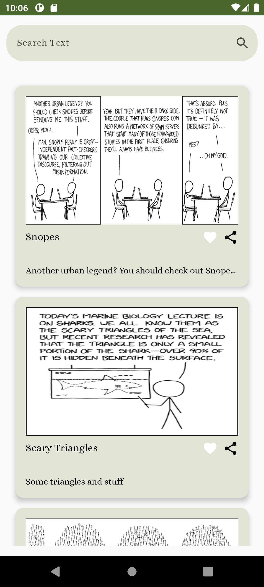
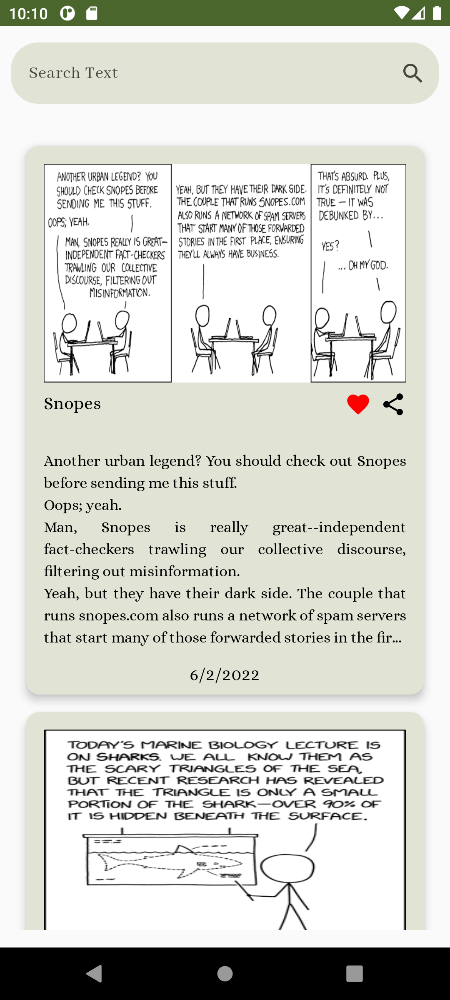
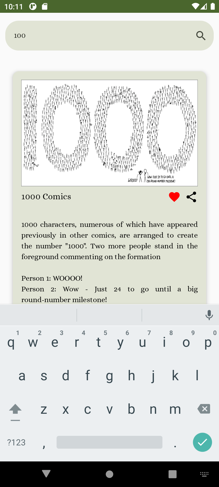
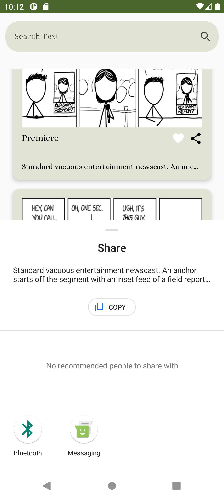

<h1 align="center"> ComicsFeed </h1>
<br>
<p align="center">
    
</p>
Comic Feed is an Android application that allows users to view and interact with a list of comics. This app offers various features that provide an engaging user experience.
<br>
<br>


## Screenshots 

<p align="center">
  
    
<br>
    
  

</p>


## Demo
[](https://drive.google.com/file/d/1pO1DvZUo8cuI-rakJGT3EwsBJ_QKIHbK/view?usp=drive_link)


[Show Demo Video](https://drive.google.com/file/d/1pO1DvZUo8cuI-rakJGT3EwsBJ_QKIHbK/view?usp=drive_link)


## Features
### Display a List of Comics:

* Users can view a list of comics.
* Each comic includes a title, image, description, date.
### Like and Share Feature:

* Users can like a comic by double-clicking on it.
* The app allows sharing the related text of the comics.
### Search Functionality:

* Users can search comics based on their title and content.
* Search results are displayed in real-time.
### Sort by Date:

* Comics can be sorted by their date.
* This feature helps users to view the newest or oldest comics.

## Data Source
* The comic data is sourced from [xkcd.com](https://xkcd.com/).
* A fixed number of comics are considered by default for the initial setup.

## Getting Started
To get started with the WeatherApp, follow these steps:

1- Clone the repository:
```
   git clone https://github.com/AtefehTaheri/ComicsFeed.git
```
2- Open the project in Android Studio.<br>

3- Build and run the application on your emulator or device.

[](https://github.com/AtefehTaheri/ComicsFeed/releases)

or Get .APK : [Releases](https://github.com/AtefehTaheri/ComicsFeed/releases)
